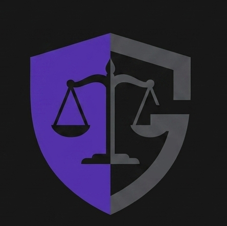
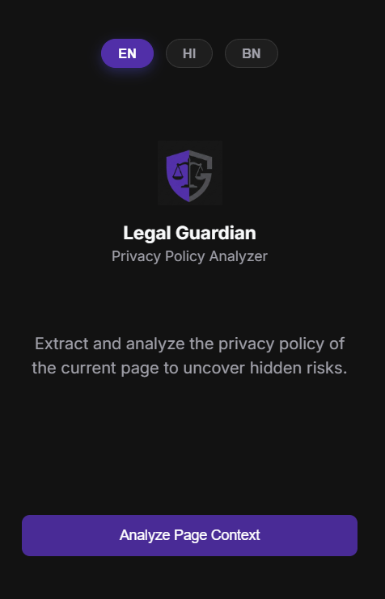

<div align="center">


# Legal Guardian Analyzer

**AI-powered browser extension that reads, scores, and explains privacy policies so you don't have to.**

<br/>

[](https://github.com/yourusername/legal-guardian)
[](https://developer.chrome.com/docs/extensions/develop/migrate/what-is-mv3)
[](LICENSE)

<br/>

[Live Dashboard →](https://legal-guardian.netlify.app/) &nbsp;·&nbsp; [Report a Bug](https://github.com/yourusername/legal-guardian/issues) &nbsp;·&nbsp; [Request a Feature](https://github.com/yourusername/legal-guardian/issues)

</div>

---

## Table of Contents

- [About the Project](#-about-the-project)
- [Features](#-features)
- [How It Works](#-how-it-works)
- [Screenshots](#-screenshots)
- [Installation Guide](#-installation-guide)
- [Usage](#-usage)
- [Project Structure](#-project-structure)
- [Tech Stack](#-tech-stack)
- [Permissions Explained](#-permissions-explained)
- [Contributing](#-contributing)
- [License](#-license)

---

## About the Project

Every website you sign up on asks you to agree to a **Privacy Policy** — a dense, lawyer-written document most people never read. Legal Guardian changes that.

Install the extension once. From that moment on, every time you land on a page with a privacy policy or terms-of-service link, Legal Guardian automatically detects it, offers to scan it, and gives you a **plain-English risk report in seconds** — powered by AI.

You can also highlight *any* text on *any* page and instantly get an AI-generated legal explanation without leaving the tab.

>  **This extension is not published yet on the Chrome Web Store.** Follow the [manual installation guide](#-installation-guide) below to load it directly into your browser.

---

## Features

#### Automatic Policy Detection
The extension silently scans every page you visit for links to privacy policies, terms of service, cookie policies, and similar documents — including PDFs. When it finds one, it shows a non-intrusive toast notification offering to scan it.

####  AI Risk Scoring
Every analyzed document receives a **Risk Score from 0 to 10**, color-coded by severity:
| Score | Level | Meaning |
|:---:|:---:|---|
| 0 – 3 | 🟢 Low | Policy is generally transparent and user-friendly |
| 4 – 6 | 🟡 Moderate | Some concerning clauses worth reviewing |
| 7 – 10 | 🔴 High | Significant data risks — proceed with caution |

#### Structured Analysis Report
Results are organized into three clear tabs:
- **Summary** — A concise overview of the document's intent and biggest risk in your regional language.
- **Pros** — User-friendly clauses and positive practices identified
- **Risks** — Red-flag clauses, hidden data sharing, broad permissions, and more

#### AI Chat Interface
After the initial analysis, open the built-in **chat window** to ask follow-up questions about specific clauses, rights, or anything else in the document.

#### Explain Button
Select any piece of legal text on any page — a clause, a paragraph, anything 15+ characters. A floating **"⚖️ Explain"** button appears above your selection. Click it to open an in-page modal with a full AI analysis, without ever leaving the site.

#### Multi-Language Support
Receive your analysis in the language of your choice. Currently supported:
- 🇬🇧 English
- 🇮🇳 Hindi (हिन्दी)
- 🇧🇩 Bengali (বাংলা)

#### PDF Document Support
Legal Guardian can fetch and parse linked **PDF documents** (like terms embedded as PDFs) and analyze them just like a normal web page.

#### Mail Integration
Open an email and click the extension — it intelligently reads the email body and analyzes any legal content found within it.
( Currently Only works on "Gmail" :) )
#### Export as PDF
Save any analysis report as a **PDF file** directly from the extension popup.

###  Web Dashboard
All analyses can be viewed in a richer format on the [Legal Guardian web dashboard](https://legal-guardian.netlify.app/).

---

## How It Works

```
┌─────────────────────────────────────────────────────────────────┐
│                        YOUR BROWSER                             │
│                                                                 │
│  ┌─────────────┐    ┌──────────────┐    ┌──────────────────┐   │
│  │  content.js │───▶│ background.js│───▶│  Render API      │   │
│  │  (Page scan,│    │  (Service    │    │  /api/ai/analyze │   │
│  │  Selection, │    │   Worker)    │    │  /api/chat       │   │
│  │  Toast UI)  │    │              │    │  /api/upload     │   │
│  └─────────────┘    └──────────────┘    └──────────────────┘   │
│         │                                        │              │
│  ┌──────▼──────┐                        ┌────────▼──────────┐  │
│  │  popup.html │                        │   AI Model        │  │
│  │  (Popup UI &│                        │   (Analysis,      │  │
│  │   Chat)     │                        │    Risk Scoring,  │  │
│  └─────────────┘                        │    Chat)          │  │
│                                         └───────────────────┘  │
└─────────────────────────────────────────────────────────────────┘
```

1. **Page Load** — `content.js` scans links on the page every 2 seconds (up to 5 attempts) for legal document keywords.
2. **Detection** — When a policy link or PDF is found, a toast notification appears.
3. **Fetching** — On user confirmation, `background.js` fetches the document content (HTML text or PDF bytes).
4. **Analysis** — The extracted text is sent to the backend AI API which returns a structured JSON report.
5. **Rendering** — The popup or in-page modal renders the Risk Score, Summary, Pros, and Risks tabs.
6. **Chat** — Follow-up questions are sent with the original document context preserved across the conversation.

---

## 📸 Screenshots


<div align="center">

<br/>
**Initial State**

---

<br/>
**Analysis Loading**

---

<br/>
**Results**

---

<br/>
**AI Chat**

---

<br/>
**Floating Button**

</div>

---

## Installation Guide

Since Legal Guardian is not published on the Chrome Web Store yet, you need to load it manually as an **unpacked extension**. This is a straightforward, official Chrome feature — no developer account required.

### Prerequisites

- Google Chrome (version 88 or later) **or** any Chromium-based browser (Edge, Brave, Opera, Arc)
- The extension files (downloaded from this repository)

---

### Step 1 — Download the Extension

**Option A — Download as ZIP (Recommended)**

Click the green **Code** button at the top of this repository and select **Download ZIP**.

<!-- PLACEHOLDER: Add a screenshot highlighting the "Download ZIP" button on GitHub -->
.png)

Once downloaded, **extract the ZIP** to a permanent location on your computer. Do not delete this folder after installation — Chrome needs it to stay there.

**Option B — Clone with Git**

```bash
git clone https://github.com/AnkanDey05/legal-guardian.git](https://github.com/AnkanDey05/Legal-Guardian-extension
```

---

### Step 2 — Open the Extensions Page

Open Google Chrome and navigate to the extensions management page. You can do this in two ways:

- Type `chrome://extensions` in the address bar and press **Enter**
- Or go to **Menu (⋮) → Extensions → Manage Extensions**

---

### Step 3 — Enable Developer Mode

In the top-right corner of the Extensions page, toggle on **Developer mode**.

<!-- PLACEHOLDER: Add a screenshot with the "Developer mode" toggle highlighted -->
.png)

>  Developer mode allows Chrome to load extensions from your local machine that aren't published in the Web Store. It is completely safe.

---

### Step 4 — Load the Extension

Click the **"Load unpacked"** button that appears after enabling Developer mode.

<!-- PLACEHOLDER: Add a screenshot with the "Load unpacked" button highlighted -->
.png)

A file picker dialog will open. Navigate to the folder where you extracted the ZIP, select the **`extension`** folder (the one that contains `manifest.json`), and click **Select Folder** (or **Open** on macOS).

```
legal-guardian/
└── extension/          ← Select THIS folder
    ├── manifest.json
    ├── background.js
    ├── content.js
    ├── content.css
    ├── popup.html
    ├── popup.css
    ├── popup.js
    └── logo.png
```

>  **Important:** Make sure you select the inner `extension` folder, not the outer repository root. The selected folder must directly contain `manifest.json`.

---

### Step 5 — Confirm Installation

Legal Guardian should now appear in your extensions list with its  icon. It's installed!

.png)

To pin it to your toolbar for easy access:

1. Click the **puzzle piece (🧩)** icon in the Chrome toolbar
2. Find **Legal Guardian** in the dropdown
3. Click the **pin icon** 📌 next to it
---

### Installing on Other Chromium Browsers

<details>
<summary><strong>Microsoft Edge</strong></summary>

1. Navigate to `edge://extensions`
2. Toggle on **Developer mode** (left sidebar)
3. Click **Load unpacked**
4. Select the `extension` folder

</details>

<details>
<summary><strong>Brave</strong></summary>

1. Navigate to `brave://extensions`
2. Toggle on **Developer mode** (top-right)
3. Click **Load unpacked**
4. Select the `extension` folder

</details>

<details>
<summary><strong>Opera / Opera GX</strong></summary>

1. Navigate to `opera://extensions`
2. Toggle on **Developer mode** (top-right)
3. Click **Load unpacked**
4. Select the `extension` folder

</details>

---

### Updating the Extension

If you pull new changes from this repository, you need to reload the extension:

1. Go to `chrome://extensions`
2. Find **Legal Guardian**
3. Click the **refresh icon (↺)** on the extension card

---

##  Usage

### Analyze a Full Page

1. Navigate to any website with a privacy policy (e.g., sign-up page, app settings).
2. Click the **⚖️ Legal Guardian icon** in the toolbar.
3. Click **"Analyze Page Context"**.
4. Wait a few seconds while the AI processes the document.
5. Review your **Risk Score**, **Summary**, **Pros**, and **Risks**.

### Use the Auto-Detection Toast

When you visit a page with a detectable privacy policy link, a toast will appear automatically at the bottom of the screen — click **"Scan Page"** to trigger the analysis instantly.

### Explain Selected Text

1. On any page, highlight any legal text (at least 15 characters).
2. A small **"⚖️ Explain"** button will float above your selection.
3. Click it to open an in-page modal with an AI explanation.

### Right-Click Scan

1. Select any text on a page.
2. Right-click and choose **"Scan with Legal Guardian"** from the context menu.

### Chat with the AI

After a successful analysis, click the **"Chat with AI"** button in the results view to open the chat interface and ask specific questions about any clause or section.

### Change Language

Before analyzing, click **EN / HI / BN** in the popup to choose your preferred response language. Your preference is saved automatically.

---

## 📁 Project Structure

```
extension/
│
├── manifest.json       # Extension configuration (MV3)
├── background.js       # Service worker — handles all API calls and context menu
├── content.js          # Injected into every page — floating button, toast, in-page modal
├── content.css         # Styles for all injected UI elements
├── popup.html          # Main popup UI structure
├── popup.css           # Popup visual styles
├── popup.js            # Popup logic — state management, rendering, chat
└── logo.png            # Extension icon (16×16, 48×48, 128×128)
```

---

##  Tech Stack

| Layer | Technology |
|---|---|
| Extension Platform | Chrome Extension Manifest V3 |
| Frontend | Vanilla HTML, CSS, JavaScript |
| Backend API | Node.js hosted on [Render](https://render.com) |
| Web Dashboard | Hosted on [Netlify](https://netlify.com) |
| AI Analysis | Gemini-3.0-flash |
| PDF Parsing | Backend-handled via `/api/upload` |

---

## Permissions Explained

Legal Guardian requests the following browser permissions. Here is exactly why each one is needed:

| Permission | Why It's Needed |
|---|---|
| `activeTab` | To read the content of the currently open tab when you click "Analyze Page Context" |
| `scripting` | To inject the floating "Explain" button and in-page modal overlay into websites |
| `storage` | To remember your language preference (EN / HI / BN) across sessions |
| `contextMenus` | To add the **"Scan with Legal Guardian"** option to the right-click menu |
| `host_permissions: <all_urls>` | To allow the extension to fetch linked privacy policy documents and PDFs from any domain |

> Legal Guardian does **not** collect, store, or transmit your browsing history. Document text is sent to the analysis API only when you explicitly trigger a scan.

---

## 🤝 Contributing

Contributions are welcome! If you find a bug or have an idea for a new feature, please open an issue first so we can discuss it.

1. Fork the repository
2. Create your feature branch: `git checkout -b feature/your-feature-name`
3. Commit your changes: `git commit -m 'feat: add some feature'`
4. Push to the branch: `git push origin feature/your-feature-name`
5. Open a Pull Request

---

## 📄 License

Distributed under the MIT License. See [`LICENSE`](LICENSE) for more information.

---

<div align="center">

Made with ❤️ &nbsp;·&nbsp; [Live Dashboard](https://legal-guardian.netlify.app/)

</div>
